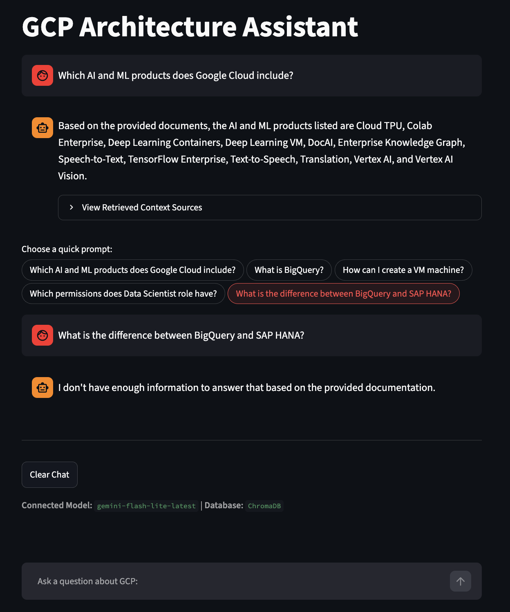

### Simple RAG Assistant Prototype on Google Cloud Platform

#### Architecture Overview 
[User Query] ➔ [Streamlit UI] ➔ [ChromaDB Vector Search] ➔ [Top-K Chunks] ➔ [Gemini API + System Instructions] ➔ [Structured Answer]

#### Key Features
- API key rotation
- output guardrails: groundedness & fact-checking
- structured outputs (Pydantic) for reliable UI rendering
- LLM-as-a-Judge evaluation pipeline
- semantic search with ChromaDB
- support of identifying and re-indexing modified existing files

#### How to Run 
1. Install Python
2. Create and activate a virtual environment:
   - cd [py-rag-gemini path]
   - python -m venv [path][venv_name] 
   - Mac/Linux: source [path to venv]/bin/activate;
   Windows: [path to venv]\Scripts\activate
3. Install dependencies:
   - pip install -r requirements.txt
4. Setup API Keys:
   - Create `auth.py` using `.auth.example` as a template
   - Run python auth.py
5. Index the documentation (build the Vector DB):
   - python _2_local_rag_pipeline.py
6. Run the Streamlit App:
   - streamlit run py_rag_app.py

